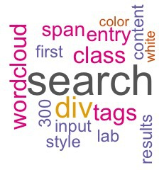

```{r echo = F, message = F}
source("../scripts/wordcloud_generator.R")
```

<p>

This is my attempt at making an electronic, version controlled, lab notebook.
</p>


# Lab Experiments
  [12-16-2015 First entry ](12-16-2015_entry.html)
 
  

#### Tags: toc
